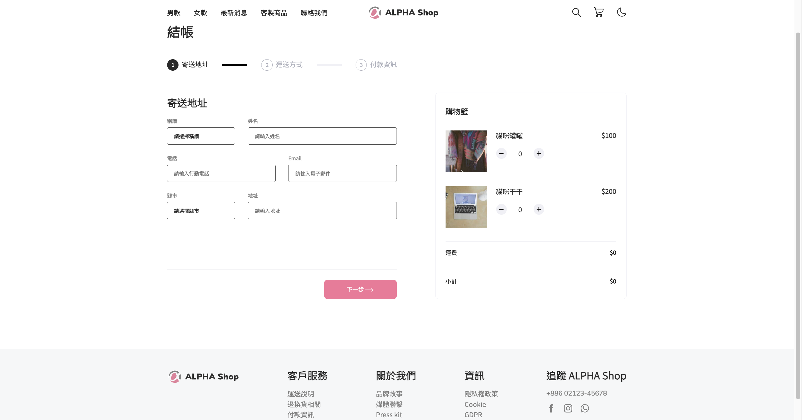
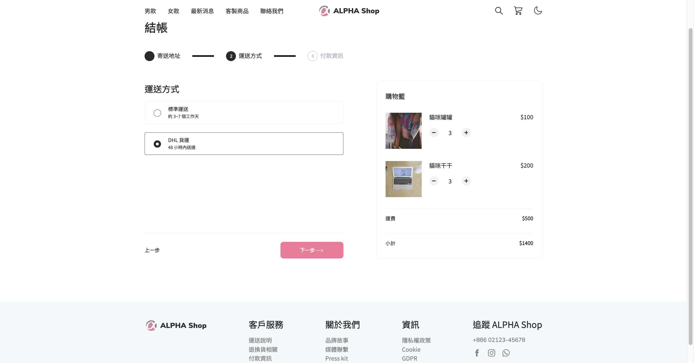

# The alphaShop (cart page) - build with React

This is a exercise to build cart page with React. The user can fill the form , and change the product quantity and calculate the amount immediately.

- Screenshot:
  
  

## Built with

- React

## Runs the app

```Shell
npm start
```

## Author

- ALPHA camp
- YAL

## Acknowledgments

- Ivy&Ciao
- Dr. Angela
- Mr. Jonas
- ALPHA camp
- and me.
